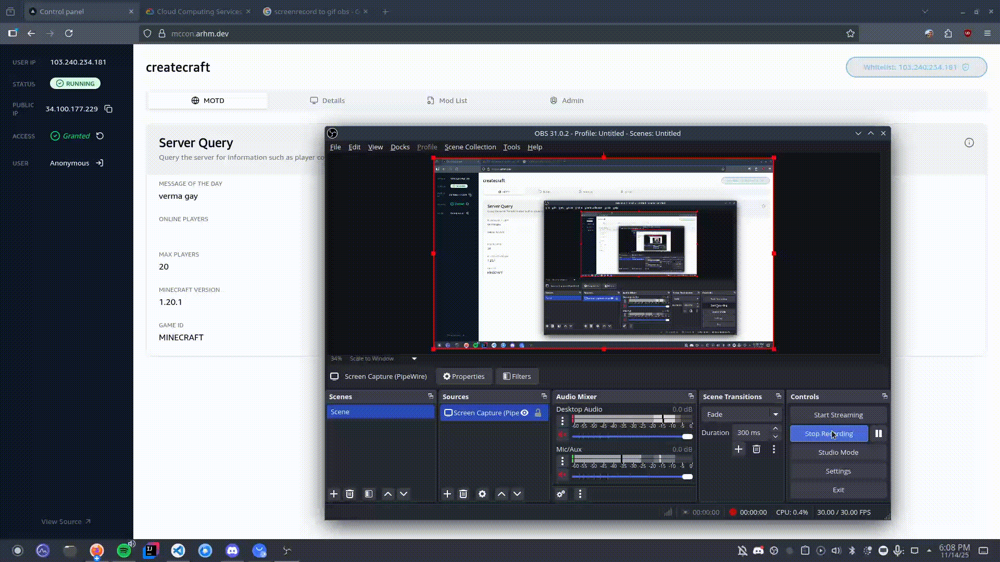
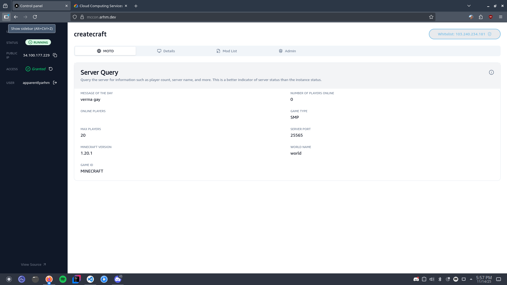
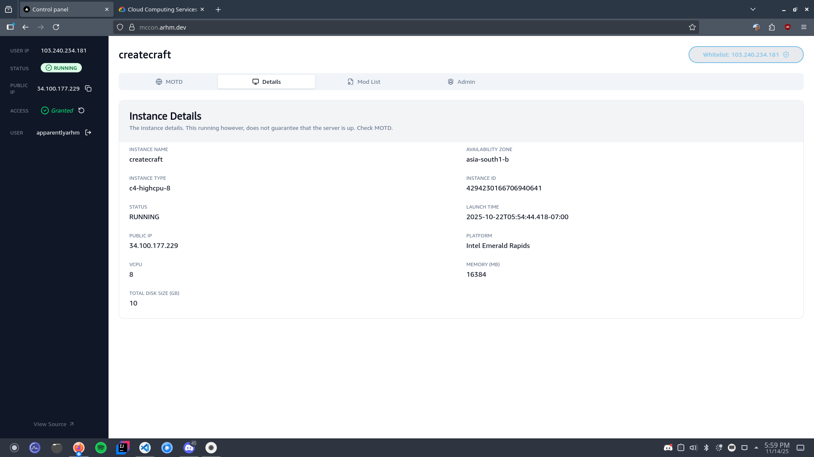

## Introduction
A control panel designed to interface with a custom Minecraft server (hyper specific to [Google Cloud Platform](https://cloud.google.com/?hl=en)) and provide stuff like 
- Server Info
- Message Of The Day
- whitelisting user IP
- Modlist View, Search, and Download (no support for adding currently)
- RCON and Access Control operations
- Oauth based Login (Github) - so inbuilt support for admin login (just make ur github)

I use this to manange my own server, as well as protect it using the firewall if necessary.

Oh yeah, I copied the AWS/Amazon aesthetic for this; Ironic.

## Small demo as admin
 

## Screenshots

## MOTD
 

## VM info
 

## Mods
 

## Admin Controls
 

## Setting up and related repos

do `npm install` first as usual AND you need the corresponding Backend for this.

[the spring boot backend](https://github.com/apparentlyarhm/validator-gcp-java)

[the terraform-based orchaestrator](https://github.com/apparentlyarhm/minecraft-terraform): this is optional, it helps automate stuff.
