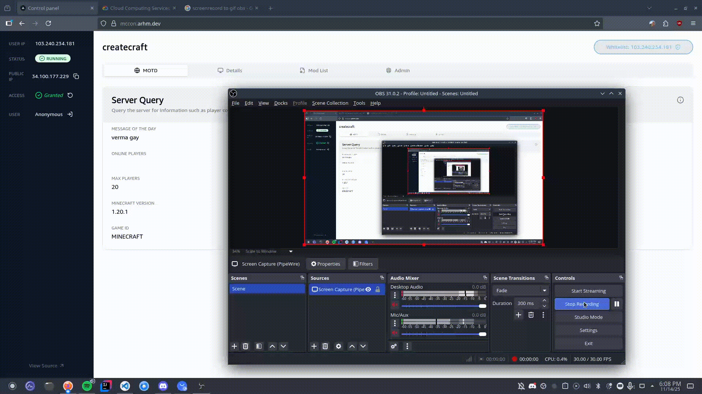
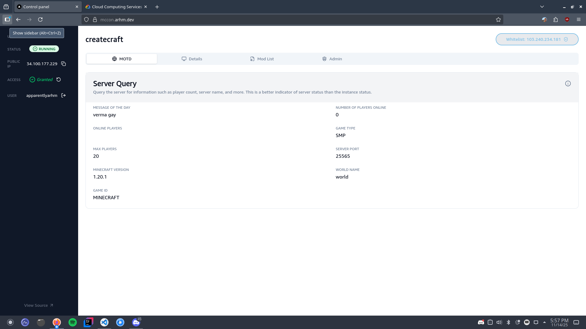
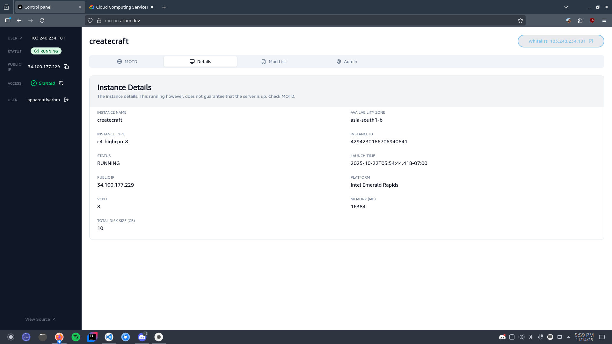
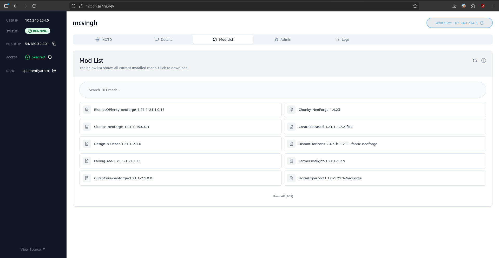
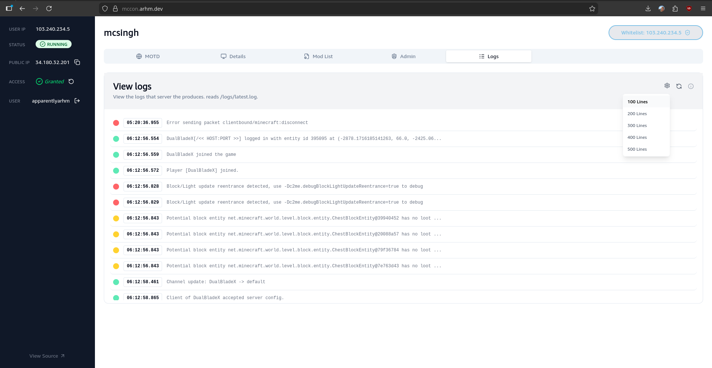
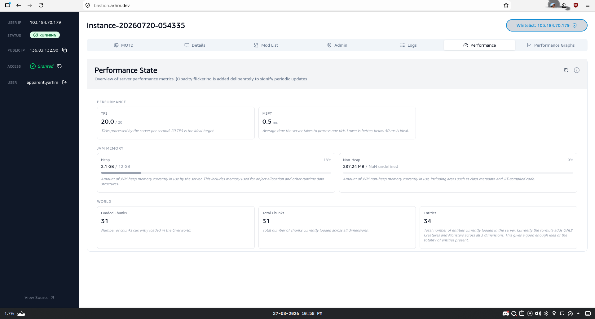
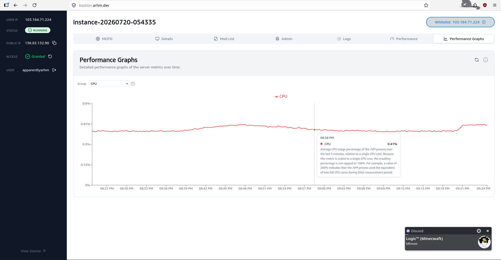
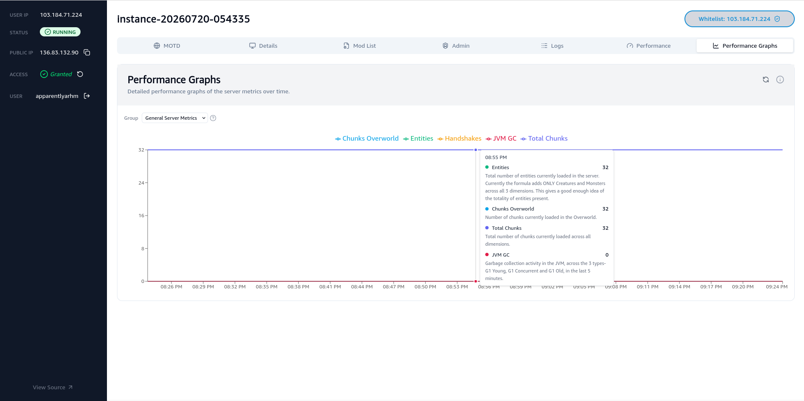
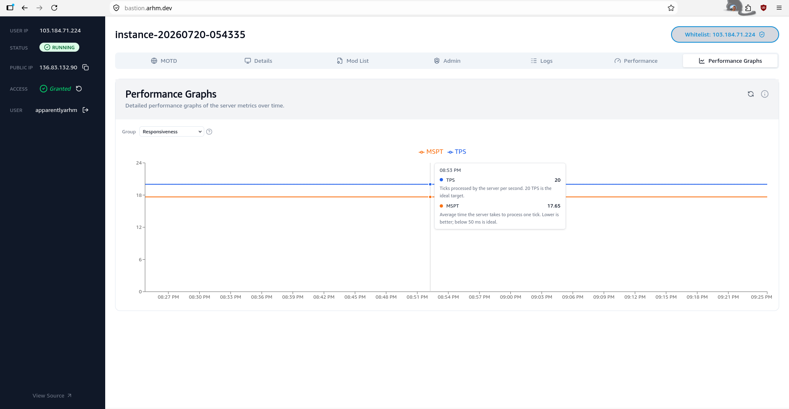
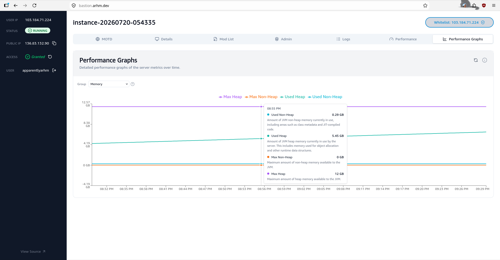

## Introduction
A control panel designed to interface with a custom Minecraft server (hyper specific to [Google Cloud Platform](https://cloud.google.com/?hl=en)) and provide stuff like 
- Server Info
- Message Of The Day
- whitelisting user IP
- Modlist View, Search, and Download (no support for adding currently)
- RCON and Access Control operations
- Read Logs from `logs/latest.log`.
- Oauth based Login (Github) - so inbuilt support for admin login (just make ur github)
- Performance Graphs with reference lines for key metrics as well as summary of all metrics in a separate tab

I use this to manange my own server, as well as protect it using the firewall if necessary.

Oh yeah, I copied the AWS/Amazon aesthetic for this; Ironic.

## Small demo as admin
 

## Screenshots

## MOTD
 

## VM info
 

## Mods
 

## Admin Controls
 

## Logs
 

added in late Aug 2026 -where the app went through a domain change.

## Metric State of the system
 

## Performance Graphs Examples

### Cpu
 

### General - Entities and stuff 
 

### Responsiveness - TPS & MSPT

### Memory - JVM stuff
 

## Setting up and related repos

do `npm install` or `bun i` first as usual AND you need the corresponding Backend for this.

[the go backend](https://github.com/apparentlyarhm/validator-gcp-go)

[the terraform-based orchaestrator](https://github.com/apparentlyarhm/minecraft-terraform): this is optional, it helps automate stuff.
